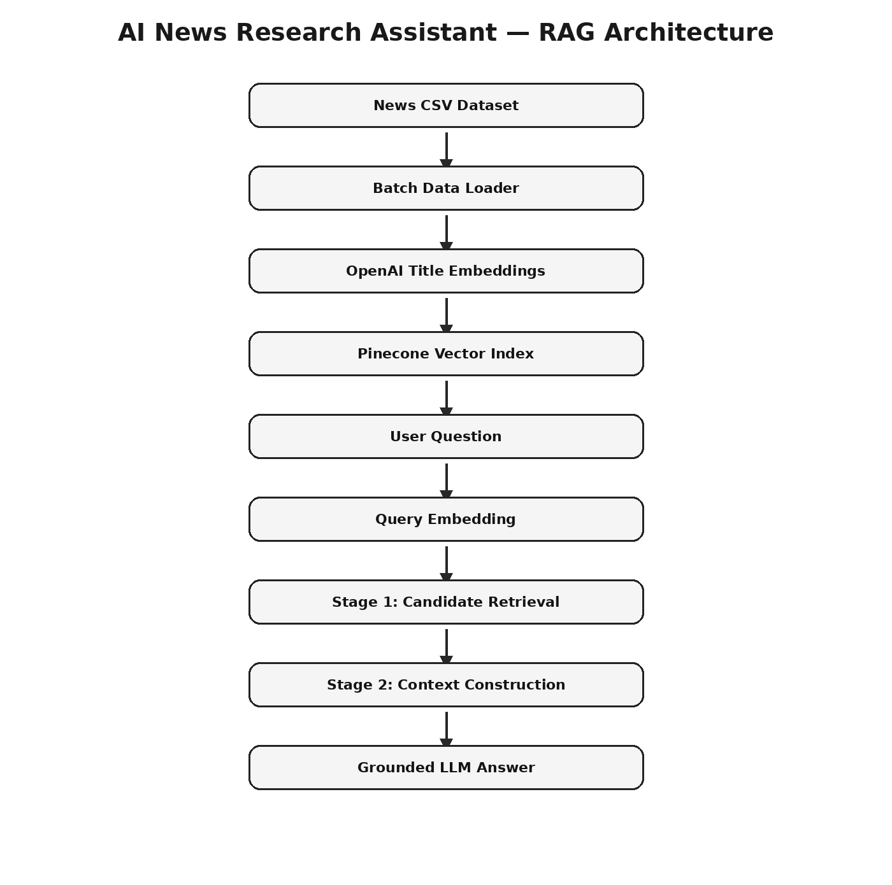

# AI News Research Assistant — Two-Stage RAG Pipeline

A production-style Retrieval-Augmented Generation project that uses OpenAI embeddings, Pinecone vector search, and a grounded LLM response layer to answer questions from a news article dataset.

> Portfolio goal: show practical GenAI engineering, RAG design, vector database usage, prompt grounding, and QA thinking for AI systems.



## Why this project exists

LLMs can sound confident even when they do not have the right context. This project reduces that risk by retrieving relevant news articles first, constructing controlled context, and instructing the LLM to answer only from retrieved data.

## What the system does

```text
News CSV Dataset
      ↓
Data Loader
      ↓
Title Embedding Generation
      ↓
Pinecone Vector Index
      ↓
User Question
      ↓
Query Embedding
      ↓
Stage 1: Candidate Article Retrieval
      ↓
Stage 2: Context Construction from Retrieved Articles
      ↓
LLM Answer Generation
      ↓
Grounded News Research Response
```

## Current implementation

This version uses a pragmatic two-stage retrieval pattern:

1. **Stage 1 — Candidate Retrieval**
   - Embeds article titles using OpenAI embeddings.
   - Stores title vectors in Pinecone.
   - Converts the user question into an embedding.
   - Retrieves top matching article candidates.

2. **Stage 2 — Context Construction + Answer Generation**
   - Pulls article metadata and article snippets from Pinecone results.
   - Builds a grounded context block.
   - Sends the context and user question to the LLM.
   - Instructs the model to answer only from the retrieved context.

## Tech stack

| Area | Technology |
|---|---|
| Language | Python |
| Embeddings | OpenAI `text-embedding-3-small` |
| LLM | OpenAI chat model |
| Vector database | Pinecone Serverless |
| Data processing | pandas |
| Token handling | tiktoken |
| API layer | FastAPI |
| Demo UI | Streamlit |
| Testing | pytest |
| DevOps | GitHub Actions, Docker |

## What makes this production-style

This project was refactored from a notebook-style prototype into a reusable engineering repo with:

- Modular Python package structure
- CLI scripts for ingestion and querying
- FastAPI endpoint for serving answers
- Streamlit demo interface
- Environment-based configuration
- Docker support
- GitHub Actions CI workflow
- Unit tests for core logic
- Architecture and design documentation
- QA strategy for GenAI-specific risks

## Project structure

```text
two-stage-rag-system/
├── src/news_rag/              # Core reusable RAG package
├── app/                       # FastAPI and Streamlit interfaces
├── scripts/                   # CLI scripts for ingest/query/evaluation
├── tests/                     # Unit tests
├── docs/                      # Architecture, design, QA, limitations
├── images/                    # Architecture and demo screenshots
├── data/                      # Local dataset location; CSV is not committed
├── .github/workflows/         # CI pipeline
├── .env.example               # Environment variable template
├── Dockerfile                 # Container build
└── README.md
```

## Documentation

- [Architecture](docs/ARCHITECTURE.md)
- [Design Decisions](docs/DESIGN_DECISIONS.md)
- [QA Test Strategy](docs/QA_TEST_STRATEGY.md)
- [Evaluation Plan](docs/EVALUATION.md)
- [Limitations](docs/LIMITATIONS.md)
- [LinkedIn Case Study](docs/LINKEDIN_CASE_STUDY.md)

## Dataset note

The dataset file is not committed to this repository. Users should download the news CSV separately and update `NEWS_CSV_PATH` in `.env`.

Expected columns include:

- `title`
- `article`
- `url`
- `publication`
- `date`
- `section`
- `author`

## Setup

### 1. Clone the repo

```bash
git clone https://github.com/vinod-ai-engineering/two-stage-rag-system.git
cd two-stage-rag-system
```

### 2. Create a virtual environment

```bash
python -m venv .venv
source .venv/bin/activate  # macOS/Linux
# .venv\Scripts\activate   # Windows
```

### 3. Install dependencies

```bash
pip install -r requirements.txt
```

### 4. Configure environment variables

```bash
cp .env.example .env
```

Update `.env`:

```bash
OPENAI_API_KEY=your_openai_api_key
PINECONE_API_KEY=your_pinecone_api_key
NEWS_CSV_PATH=./data/all-the-news-3.csv
```

Before running ingestion, make sure:

- `.env` is configured
- Pinecone API key is valid
- OpenAI API key is valid
- `NEWS_CSV_PATH` points to an existing CSV file

## Run ingestion

```bash
python scripts/ingest_news.py
```

## Ask a question from CLI

```bash
python scripts/ask_question.py "What happened with Obama?"
```

## Run FastAPI

```bash
uvicorn app.api:app --reload
```

Example request:

```bash
curl -X POST http://127.0.0.1:8000/ask \
  -H "Content-Type: application/json" \
  -d '{"question":"What happened with Obama?", "top_k":3}'
```

## Run Streamlit demo

```bash
streamlit run app/streamlit_app.py
```

## Example output

```text
Question:
What happened with Obama?

Answer:
Based on the retrieved article context, the system found articles discussing Obama in relation to political events and public statements. The answer is generated only from the retrieved article snippets. If the retrieved context is incomplete, the assistant is instructed to say that the available articles do not provide enough information.

Sources:
1. "Example Article Title", Publication, Date
2. "Example Article Title", Publication, Date
```

Replace the example above with a real run output after indexing your local dataset.

## Testing

```bash
pytest -q
```

## QA mindset applied to GenAI

This project includes a RAG-specific QA strategy covering:

- Retrieval relevance
- Groundedness
- Hallucination risk
- Prompt injection resistance
- API failure paths
- Empty/invalid input handling
- Metadata-size constraints
- Token-limit safety

See [`docs/QA_TEST_STRATEGY.md`](docs/QA_TEST_STRATEGY.md).

## Current limitations

This repo is intentionally honest about tradeoffs:

- Current retrieval uses title embeddings, not full article chunk embeddings.
- Article content is stored as metadata snippets.
- No production reranker is included yet.
- Dataset download is not bundled because the source data may have license restrictions.
- Evaluation is lightweight and should be expanded before production use.

See [`docs/LIMITATIONS.md`](docs/LIMITATIONS.md).

## Roadmap

- Add article body chunking.
- Add hybrid dense + sparse retrieval.
- Add LLM or cross-encoder reranking.
- Add source citation formatting.
- Add retrieval evaluation metrics: Recall@K, Precision@K, MRR.
- Add Docker deployment example.
- Add hosted demo screenshots.

## Portfolio summary

This project demonstrates the ability to convert a notebook-style RAG prototype into a production-style AI engineering repo with modular code, documentation, testing, and deployment-ready structure.
